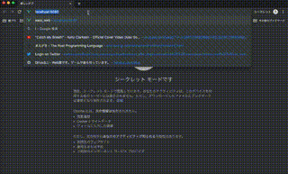
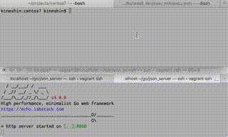

# Overview
 - Web page for CTF

## Front(Vue.js)


## Back(JSON server)



# Features
## Front
 - Vue.js(SPA)
 - Get Result from Judge Server by Usign POST Request

## Back
 - Golang
 - Get Requests and Response
 - Refer to the flag datas in MySQL Server

# Usage
```bash
$ yarn dev # Build Server for Front Web Page
$ go run main.go # Build Server for Back JSON Server
```
